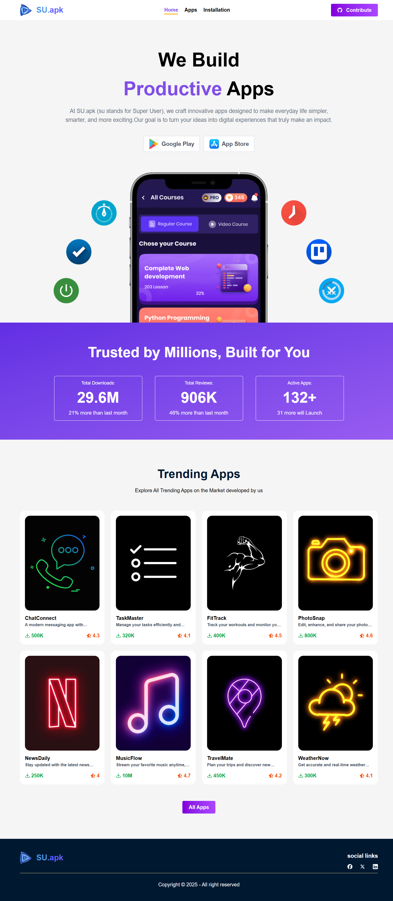
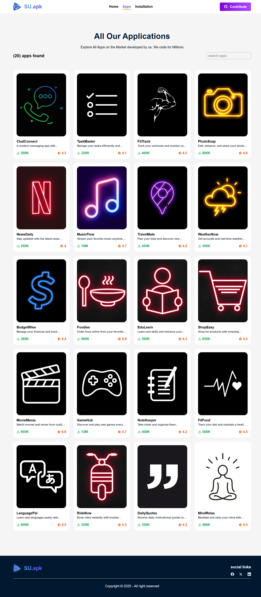
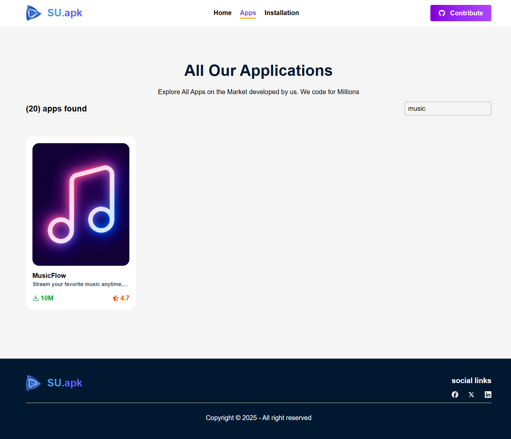
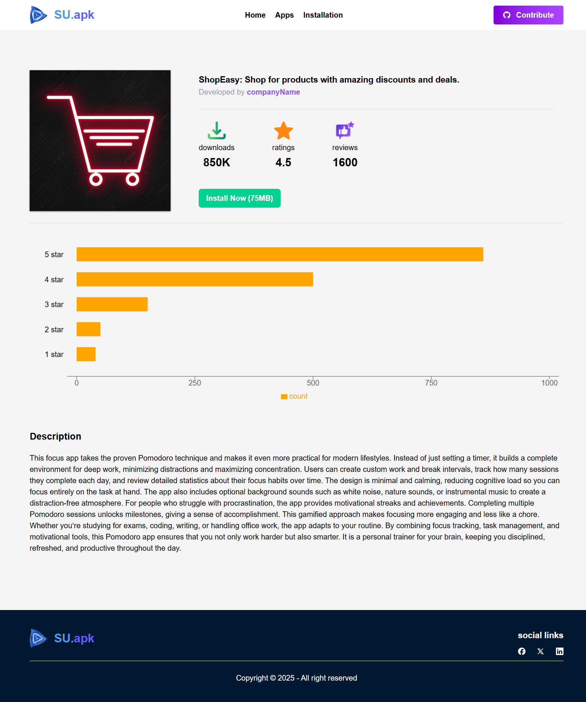
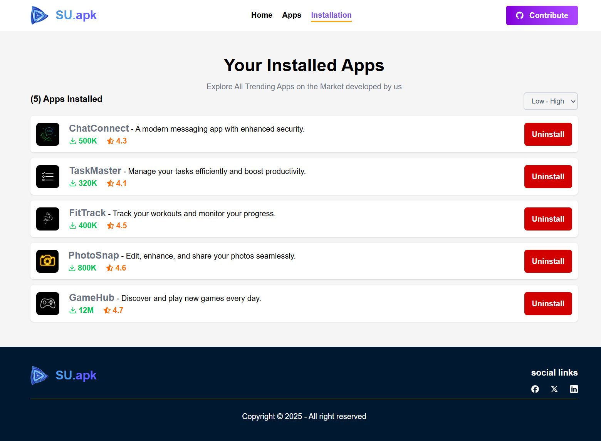

# SU.apk — Super User Android App Hub 🚀

**SU.apk** (Super User APK) is a sleek, React-powered web application that showcases and distributes Android APK files. Built with Tailwind CSS for rapid styling and responsive design, SU.apk offers users a fast, effcient way to explore and install Android apps directly from the browser.

---

## 🧩 Features

- 🔍 **Live Search** — Instantly filter apps with a responsive search bar
- 📦 **APK Listings** — Browse a curated collection of Android apps
- 📥 **Download Tracker** — See real-time download counts and ratings
- 🌐 **Responsive UI** — Optimized for mobile and desktop devices
- ⚡ **Built with React + Tailwind** — Fast, maintainable, and modern

---

## 🛠️ Tech Stack

| Technology   | Purpose                       |
| ------------ | ----------------------------- |
| React        | UI and component architecture |
| Tailwind CSS | Utility-first styling         |
| Vite         | Fast dev server and bundling  |
| React Router | Client-side routing           |

---

## 📸 Screenshots

;

;

;

;

---

# Credits

Built with patience and thoughts by **AminurRahman** using React, Tailwind, and a passion for clean UI.

---

